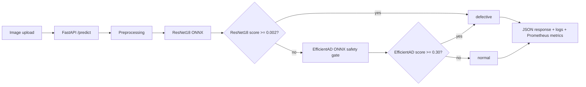

# Surface Defect MLOps

Computer vision repo for surface-defect inspection. The project packages a selected model policy into a FastAPI inference service, exports inference to ONNX Runtime, adds Docker and CI checks, and includes drift monitoring plus retraining-trigger scaffolding.

The full inspection dataset is not included. Retained prediction artifacts are included so the evaluation summary can be regenerated without shipping raw inspection images.

## Summary

**Problem:** Build a surface-defect screening system that stays useful when visual acquisition conditions shift.

**What I built:** A FastAPI + ONNX Runtime inference service, drift and retraining scaffolding, sample-data evaluation scripts, benchmark utilities, and artifact lineage/report manifests.

**Core result:** The project shows why operating-threshold selection matters more than AUROC alone, then packages the selected defect policy into a serving stack with monitoring-oriented metadata.

**Tech stack:** Python, FastAPI, ONNX Runtime, PyTorch, Docker, Prometheus metrics, pytest, Ruff, Black.

**What is intentionally omitted:** The full inspection dataset, sensitive operator-review signals, and organization-specific infra details.

## Project Overview

The inspection task is binary classification:

- `normal`: acceptable part
- `defective`: part should be rejected or reviewed

The selected model policy is a selective policy:

1. Run a tuned ResNet18 classifier as the primary detector.
2. If ResNet18 does not flag the image, run an EfficientAD anomaly safety gate.
3. Return a JSON prediction with model scores, thresholds, decision reason, and latency breakdown.

## Architecture



## Key Results

Held-out evaluation showed why thresholded operating behavior matters more than AUROC alone.

| Policy | Precision | Recall | F1 | False Positives | False Negatives |
|---|---:|---:|---:|---:|---:|
| Original ResNet18 threshold | 1.0000 | 0.6979 | 0.8221 | 0 | 561 |
| ResNet18 + EfficientAD safety gate | 0.9376 | 0.9553 | 0.9464 | 118 | 83 |

The hybrid policy improves missed-defect count modestly over tuned ResNet18. Tuned ResNet18 remains the simpler single-model baseline; the hybrid is useful when the small recall gain is worth the extra model and monitoring surface.

Detailed analysis:

- [Model Selection Report](reports/model_selection_report.md)
- [ResNet18 Failure Analysis](reports/resnet18_failure_analysis.md)
- [Anomaly Model Analysis](reports/anomaly_model_analysis.md)
- [Final Hybrid Policy Report](reports/final_hybrid_policy_report.md)
- [Load Test Summary](reports/load_test_summary.md)

## Local Setup

```bash
python -m venv .venv
source .venv/bin/activate  # Windows: .venv\Scripts\activate
pip install -r requirements.txt
pip install -r requirements-dev.txt
```

Optional offline-training dependencies:

```bash
pip install -r requirements-ml.txt
```

Run tests:

```bash
pytest
ruff check .
black --check .
```

Run the API:

```bash
uvicorn app.main:app --host 0.0.0.0 --port 8000
```

Health check:

```bash
curl http://localhost:8000/health
```

Prediction:

```bash
curl -X POST "http://localhost:8000/predict" \
  -F "file=@path/to/image.jpg"
```

## Docker Run

```bash
docker build -t surface-defect-mlops-api .
docker run --rm -p 8000:8000 surface-defect-mlops-api
```

## Cloud Run

The app is designed for Google Cloud Run using the included Dockerfile.

```bash
gcloud builds submit --tag gcr.io/PROJECT_ID/surface-defect-mlops-api
gcloud run deploy surface-defect-mlops-api \
  --image gcr.io/PROJECT_ID/surface-defect-mlops-api \
  --platform managed \
  --region us-central1 \
  --memory 2Gi \
  --cpu 2 \
  --concurrency 4 \
  --max-instances 3 \
  --allow-unauthenticated
```

Use authenticated access for non-demo services.

## Load Testing

Load testing is implemented with asynchronous HTTP requests:

```bash
python load_tests/cloudrun_load_test.py \
  --service-url https://YOUR_CLOUD_RUN_URL \
  --image-dir path/to/non-sensitive/load-test-images \
  --requests 1000 \
  --concurrency 4
```

The script reports success rate, requests per second, estimated daily throughput, and latency percentiles. Synthetic load images can be generated from a safe image folder with:

```bash
python load_tests/generate_synthetic_load_images.py \
  --source-dir path/to/source-images \
  --output-dir load_tests/generated \
  --count 1000
```

## Drift and Retraining

The drift pipeline builds baseline and recent-sample profiles using image-quality statistics:

- brightness mean
- contrast standard deviation
- sharpness via Laplacian variance
- defect-rate change

Drift detection compares feature means and Kolmogorov-Smirnov statistics, then writes a drift report. If configured thresholds are exceeded, the retraining trigger creates a candidate manifest for human-reviewed samples.

See [DRIFT_AND_RETRAINING.md](DRIFT_AND_RETRAINING.md) for details.

## Retained Prediction Reproducibility

Raw retained images are not included in the repository. The tracked reproducibility path uses saved prediction artifacts from a retained evaluation sample.

Regenerate report artifacts from saved predictions:

```bash
python -m scripts.reproduce_retained_sample_pipeline --from-saved-predictions
```

If local retained images are available in `data_samples/`, the full sample pipeline can also rebuild the manifest, split CSVs, predictions, threshold summary, and report artifacts:

```bash
python -m scripts.reproduce_retained_sample_pipeline
```

This flow:

1. reads the saved retained-sample predictions
2. tunes the threshold from those saved predictions
3. rewrites sample metrics, score-monitoring summaries, and results manifests

See:

- [Dataset Contract](docs/DATASET_CONTRACT.md)
- [Architecture](docs/ARCHITECTURE.md)
- [Results Manifest](reports/results_manifest.json)

## Repository Map

| Path | Purpose |
|---|---|
| `app/` | FastAPI inference service and ONNX model wrappers |
| `configs/` | Model policy and calibration settings |
| `models/` | ONNX model artifacts used by the local demo service |
| `reports/` | Model-analysis reports and generated plots |
| `drift/` | Drift baseline, detection, retraining-trigger logic, and tests |
| `load_tests/` | Cloud Run/API load testing utilities |
| `scripts/` | Sample evaluation, training, export, and benchmark scripts |
| `infra/` | Cloud Run and Terraform notes |
| `.github/workflows/` | CI and Docker build validation |

## Additional Docs

- [PROJECT_SUMMARY.md](PROJECT_SUMMARY.md)
- [MODEL_CARD.md](MODEL_CARD.md)
- [DEPLOYMENT.md](DEPLOYMENT.md)
- [DRIFT_AND_RETRAINING.md](DRIFT_AND_RETRAINING.md)
- [docs/DATASET_CONTRACT.md](docs/DATASET_CONTRACT.md)
- [docs/ARCHITECTURE.md](docs/ARCHITECTURE.md)
