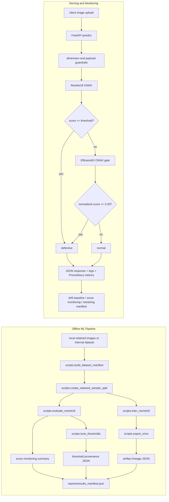

# Offline and Online Architecture

## Notes

- The repo has an inspectable offline pipeline, even though the full data workflow is intentionally excluded.
- `scripts.reproduce_retained_sample_pipeline --from-saved-predictions` regenerates report artifacts from tracked retained-sample predictions.
- `reports/results_manifest.json` ties the visible reports back to exact artifacts.
