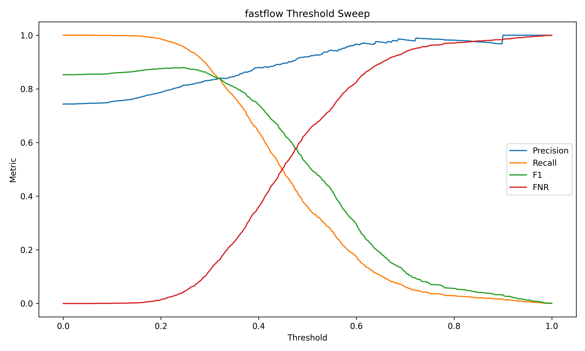
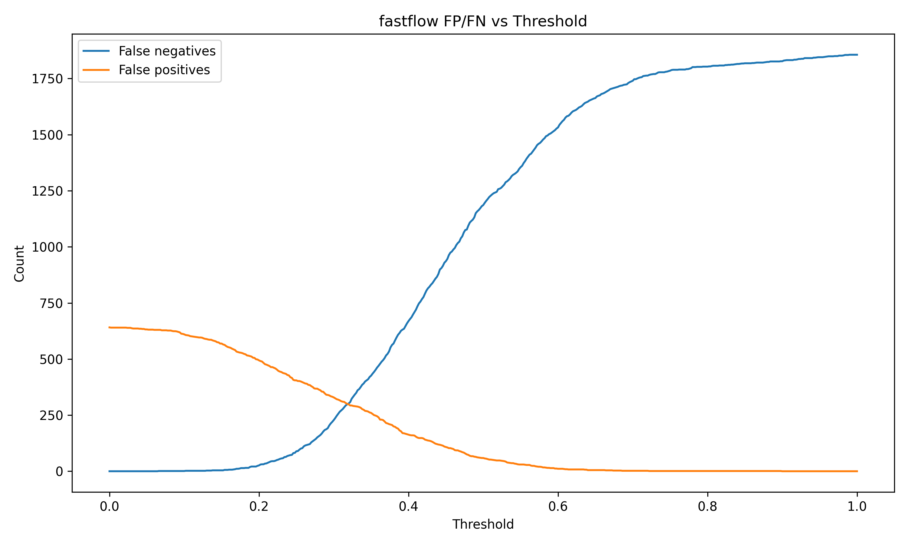
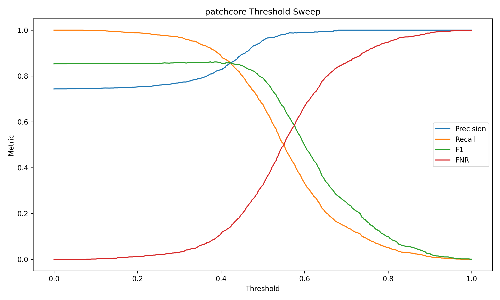
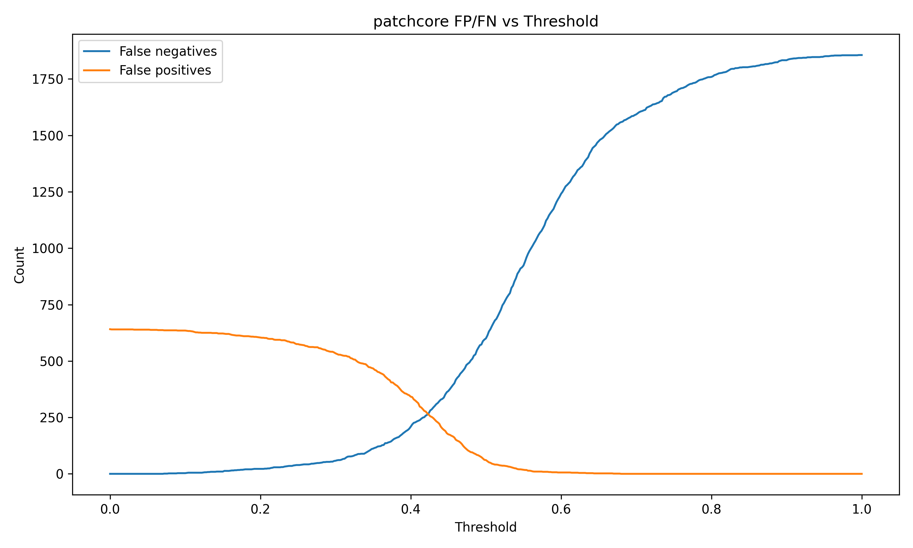
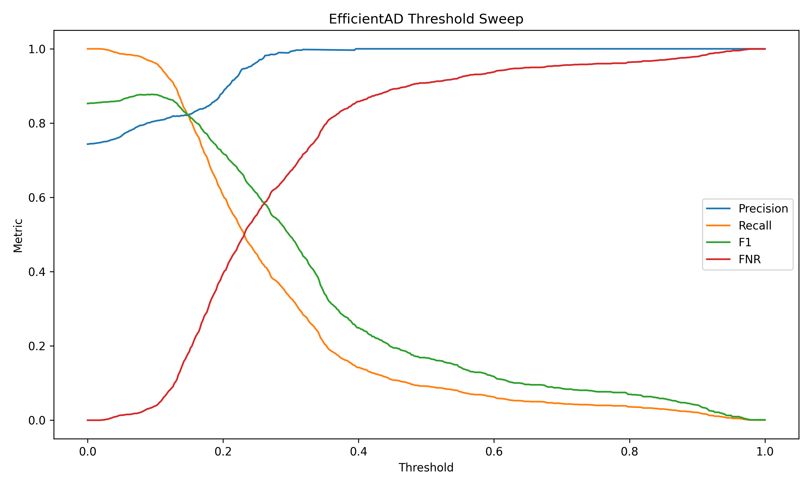
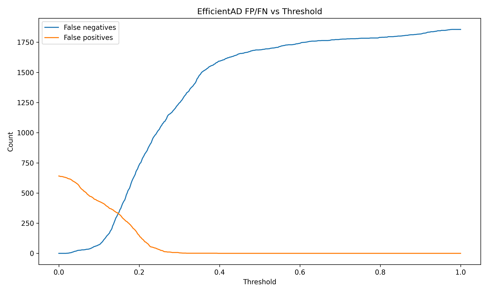

# Anomaly Model Analysis

## Executive Summary

PatchCore, FastFlow, and EfficientAD were evaluated as anomaly-detection alternatives or safety-net signals for the Oct14-to-Nov8 inspection setting. They can improve recall compared with the original ResNet18 threshold, but they also introduce a much larger false-positive burden.

Against the tuned ResNet18 threshold, the anomaly models are not better standalone models. Tuned ResNet18 remains the best balanced single model. FastFlow and EfficientAD are useful mainly as possible safety-net signals when the operation can tolerate additional review.

## Model Comparison

| Model / Operating Point | AUROC | AUPRC | Precision | Recall | F1 | False Positives | False Negatives |
|---|---:|---:|---:|---:|---:|---:|---:|
| ResNet18, original threshold | 0.9685 | n/a | 1.0000 | 0.6979 | 0.8221 | 0 | 561 |
| ResNet18, tuned threshold | 0.9685 | 0.9902 | 0.9394 | 0.9521 | 0.9457 | 114 | 89 |
| FastFlow, best F1 | 0.7721 | 0.8980 | 0.8109 | 0.9607 | 0.8795 | 416 | 73 |
| PatchCore, best F1 | 0.8473 | 0.9462 | 0.8088 | 0.9225 | 0.8619 | 405 | 144 |
| EfficientAD, best F1 | 0.7834 | 0.9187 | 0.8031 | 0.9666 | 0.8773 | 440 | 62 |

FastFlow and EfficientAD miss fewer defects than tuned ResNet18 at their best-F1 points, but they add hundreds of false positives. PatchCore has stronger ranking metrics than FastFlow and EfficientAD, but its best-F1 threshold misses more defects than tuned ResNet18.

## FastFlow

| Recall Target | Threshold | Recall | Precision | False Positives | False Negatives |
|---|---:|---:|---:|---:|---:|
| >= 0.90 | 0.288 | 0.9009 | 0.8282 | 347 | 184 |
| >= 0.95 | 0.252 | 0.9515 | 0.8147 | 402 | 90 |
| >= 0.98 | 0.210 | 0.9812 | 0.7932 | 475 | 35 |
| >= 0.99 | 0.186 | 0.9919 | 0.7815 | 515 | 15 |

FastFlow is the strongest anomaly safety-net candidate by missed-defect count, but it requires a high review load to reach high recall.

## PatchCore

| Recall Target | Threshold | Recall | Precision | False Positives | False Negatives |
|---|---:|---:|---:|---:|---:|
| >= 0.90 | 0.392 | 0.9004 | 0.8241 | 357 | 185 |
| >= 0.95 | 0.338 | 0.9521 | 0.7840 | 487 | 89 |
| >= 0.98 | 0.242 | 0.9812 | 0.7579 | 582 | 35 |
| >= 0.99 | 0.176 | 0.9903 | 0.7506 | 611 | 18 |

PatchCore ranks Nov8 samples better than FastFlow by AUROC and AUPRC, but at high-recall thresholds it creates even more false positives.

## EfficientAD

EfficientAD was evaluated because it is designed for fast anomaly detection using a student-teacher architecture.

| Operating Point | Threshold | Precision | Recall | F1 | False Positives | False Negatives |
|---|---:|---:|---:|---:|---:|---:|
| Recall >= 0.90 | 0.126 | 0.8191 | 0.9095 | 0.8620 | 373 | 168 |
| Recall >= 0.95 | 0.106 | 0.8073 | 0.9521 | 0.8737 | 422 | 89 |
| Recall >= 0.98 | 0.076 | 0.7927 | 0.9801 | 0.8765 | 476 | 37 |
| Best F1 | 0.094 | 0.8031 | 0.9666 | 0.8773 | 440 | 62 |

EfficientAD catches more defects than tuned ResNet18 at best F1, but the false-positive load is almost four times higher. It does not replace ResNet18 as the balanced baseline.

The final hybrid evaluation also tested stricter EfficientAD gate thresholds. Those thresholds are intentionally higher than the standalone best-F1 threshold because the anomaly model is being used as a secondary safety signal, not as the primary classifier. The goal is to catch a few additional ResNet18 misses without inheriting the full standalone anomaly-model false-positive burden.

## Review-Budget Perspective

| Model | Budget / Point | Recall | False Positives | False Negatives |
|---|---|---:|---:|---:|
| Tuned ResNet18 | Best F1 | 0.9521 | 114 | 89 |
| FastFlow | FP <= 100 | 0.4680 | 99 | 988 |
| PatchCore | FP <= 100 | 0.7345 | 100 | 493 |
| EfficientAD | FP <= 100 | 0.5563 | 96 | 824 |

Under strict false-positive budgets, anomaly models do not provide enough recall. Their value appears only when hundreds of reviewed images are acceptable.

## Production Interpretation

The anomaly models are valuable diagnostic and safety-net candidates, but not the best standalone choice. They help answer an important question: can a second model catch defects ResNet18 misses? The answer is yes, but the extra catches come with a substantial review cost.

The final decision therefore needs to evaluate hybrid policies rather than selecting the highest-recall anomaly threshold in isolation. See [Final Hybrid Policy Report](final_hybrid_policy_report.md).

## Additional Figures

- [FastFlow precision-recall curve](figures/evaluation/anomaly_model_analysis/fastflow_precision_recall_curve.png)
- [FastFlow ROC curve](figures/evaluation/anomaly_model_analysis/fastflow_roc_curve.png)
- [FastFlow score histogram](figures/evaluation/anomaly_model_analysis/fastflow_score_histogram_by_true_label.png)
- [PatchCore precision-recall curve](figures/evaluation/anomaly_model_analysis/patchcore_precision_recall_curve.png)
- [PatchCore ROC curve](figures/evaluation/anomaly_model_analysis/patchcore_roc_curve.png)
- [PatchCore score histogram](figures/evaluation/anomaly_model_analysis/patchcore_score_histogram_by_true_label.png)
- [EfficientAD precision-recall curve](figures/evaluation/efficientad/efficientad_precision_recall_curve.png)
- [EfficientAD ROC curve](figures/evaluation/efficientad/efficientad_roc_curve.png)
- [EfficientAD score histogram](figures/evaluation/efficientad/efficientad_score_histogram_by_true_label.png)
