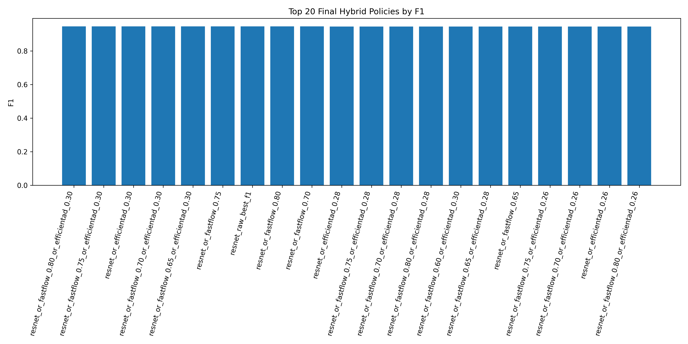
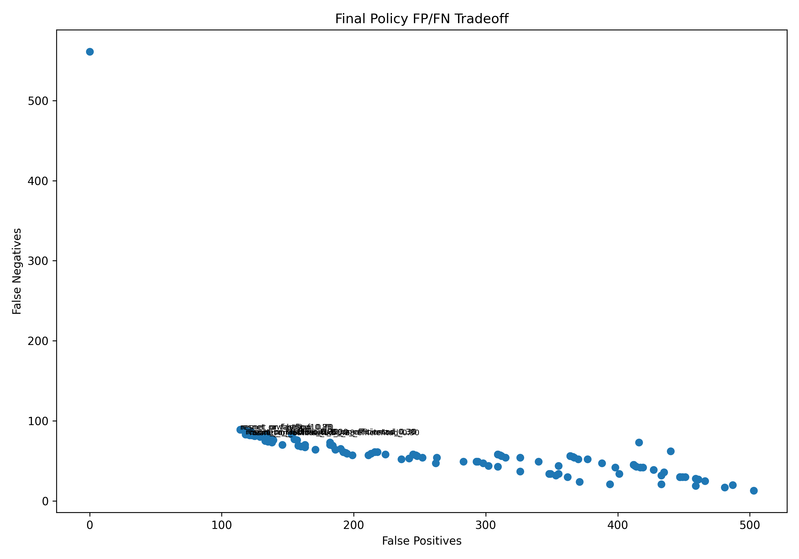
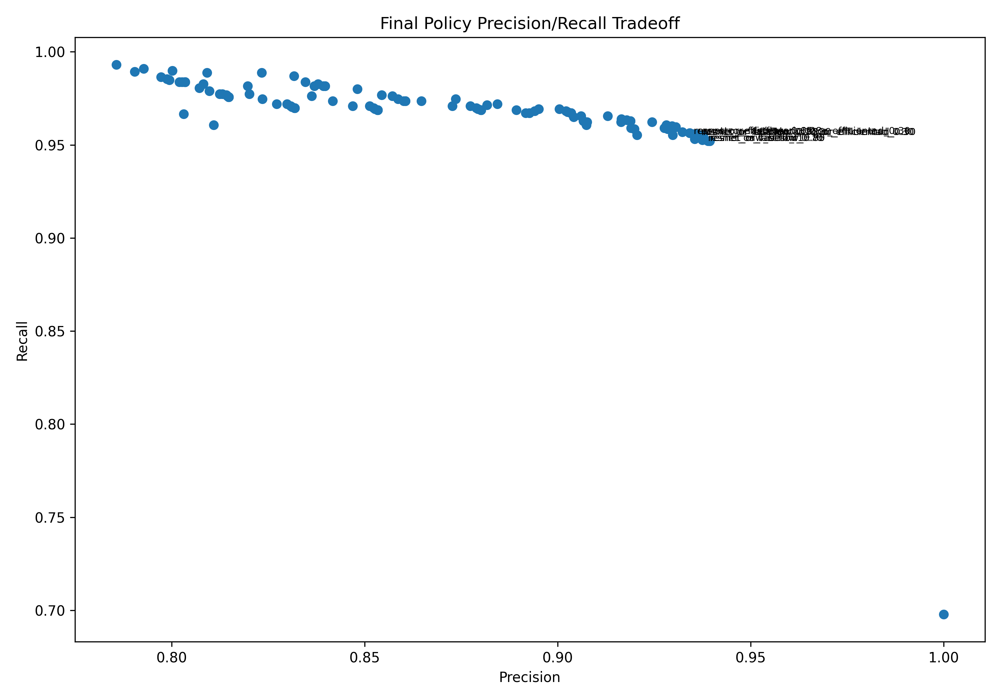

# Final Hybrid Policy Report

## Executive Summary

The selected policy is a selective hybrid using tuned ResNet18 with an EfficientAD safety gate:

`resnet_or_efficientad_0.30`

This policy produced the highest F1 among evaluated final candidates that kept false positives close to the tuned ResNet18 baseline. It modestly improved recall over tuned ResNet18, reducing false negatives from `89` to `83` while increasing false positives from `114` to `118`.

The improvement is small. Tuned ResNet18 remains the simplest and strongest single-model baseline. The hybrid policy is only preferable if the team accepts the extra model artifact, threshold, latency, and monitoring surface in exchange for catching a small number of additional defects.

## Candidate Summary

| Policy | Type | Precision | Recall | F1 | False Positives | False Negatives | Specificity |
|---|---|---:|---:|---:|---:|---:|---:|
| ResNet18, original threshold | Single model | 1.0000 | 0.6979 | 0.8221 | 0 | 561 | 1.0000 |
| ResNet18, tuned threshold | Single model | 0.9394 | 0.9521 | 0.9457 | 114 | 89 | 0.8222 |
| ResNet18 OR EfficientAD 0.30 | Selective hybrid | 0.9376 | 0.9553 | 0.9464 | 118 | 83 | 0.8159 |
| ResNet18 OR FastFlow 0.65 OR EfficientAD 0.30 | Triple hybrid | 0.9362 | 0.9558 | 0.9459 | 121 | 82 | 0.8112 |

The triple hybrid catches one more defect than the selected policy but adds three more false positives and slightly lowers F1. The selected policy is therefore simpler and cleaner.

## Selected Policy

| Metric | Value |
|---|---:|
| Accuracy | 0.9195 |
| Balanced accuracy | 0.8856 |
| Precision | 0.9376 |
| Recall | 0.9553 |
| F1 | 0.9464 |
| False-positive rate | 0.1841 |
| False-negative rate | 0.0447 |
| Specificity | 0.8159 |
| True negatives | 523 |
| False positives | 118 |
| False negatives | 83 |
| True positives | 1,774 |

Policy behavior:

- ResNet18 provides the primary supervised defect signal.
- EfficientAD at threshold `0.30` acts as a strict selective safety gate.
- A sample is flagged defective if either the tuned ResNet18 threshold or the EfficientAD safety threshold fires.

The EfficientAD threshold is intentionally stricter than its standalone best-F1 threshold. In the hybrid policy, EfficientAD is not being used to maximize standalone anomaly-model recall; it is being used to catch a small number of ResNet18 misses while limiting incremental false positives.

## Why Not Use a More Aggressive Anomaly Gate?

More aggressive anomaly thresholds catch additional ResNet18 misses, but they also add many false positives. For example, strong anomaly safety-net settings can catch dozens of additional missed defects, but may add hundreds of review items. That is not clearly better unless the operation has enough manual review capacity.

The selected policy balances three goals:

- keep the tuned ResNet18 precision/recall profile,
- recover a small number of additional defects,
- avoid turning the anomaly model into a high-volume review trigger.

## Model-Selection Rationale

Tuned ResNet18 is the best balanced single model:

| Metric | Tuned ResNet18 |
|---|---:|
| Threshold | 0.002 |
| Precision | 0.9394 |
| Recall | 0.9521 |
| F1 | 0.9457 |
| False positives | 114 |
| False negatives | 89 |

The selected hybrid is a minimal extension that improves recall and F1 slightly:

| Metric | Selected Hybrid | Change vs Tuned ResNet18 |
|---|---:|---:|
| Precision | 0.9376 | -0.0018 |
| Recall | 0.9553 | +0.0032 |
| F1 | 0.9464 | +0.0007 |
| False positives | 118 | +4 |
| False negatives | 83 | -6 |

This is the most defensible selected policy from the evaluated artifacts if the small recall gain is worth the added complexity. If operational simplicity is prioritized over catching the additional six defects in this held-out set, tuned ResNet18 at threshold `0.002` is the cleaner baseline.

## Service Readiness Notes

This repository packages the selected policy as an inference service with:

- versioned model artifacts and thresholds,
- deterministic preprocessing,
- request/response schema validation,
- unit and integration tests for inference behavior,
- Cloud Run configuration,
- load testing,
- input drift monitoring for brightness, contrast, sharpness, and score distributions,
- retraining pipeline scaffolding for future shifted data.

The selected model policy should still be validated against explicit review-capacity and escaped-defect targets, then monitored during use because the root issue identified by the reports is temporal acquisition shift.
