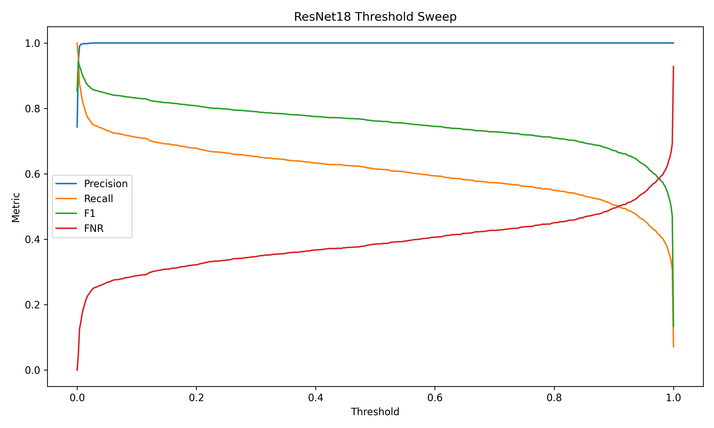
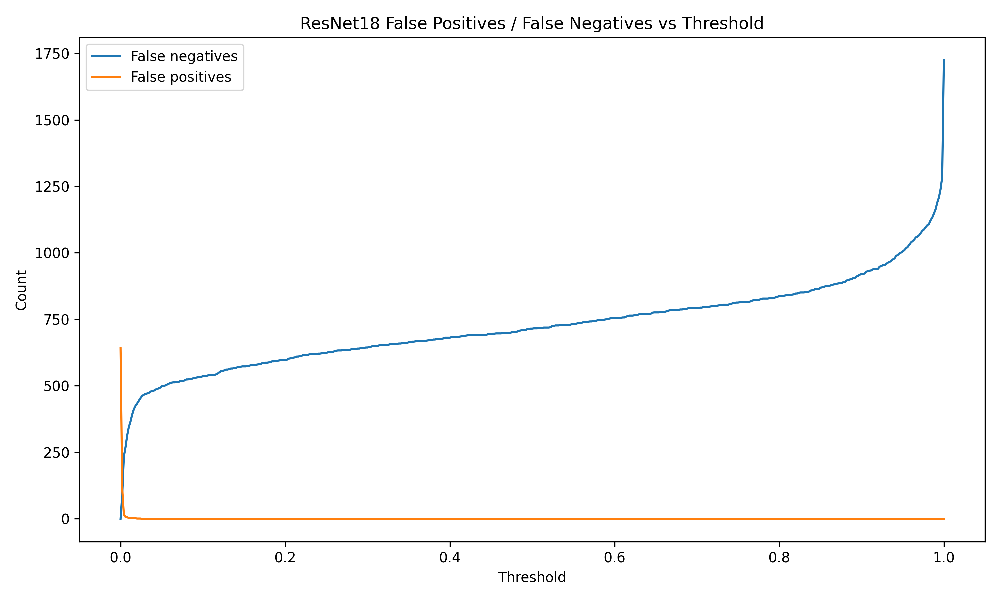
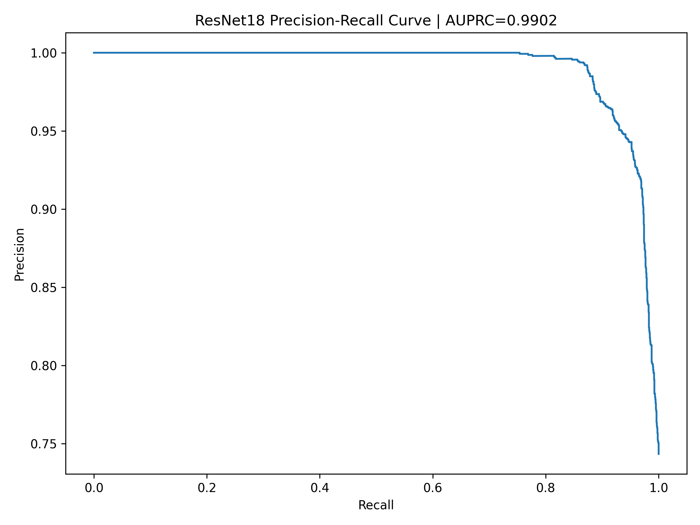
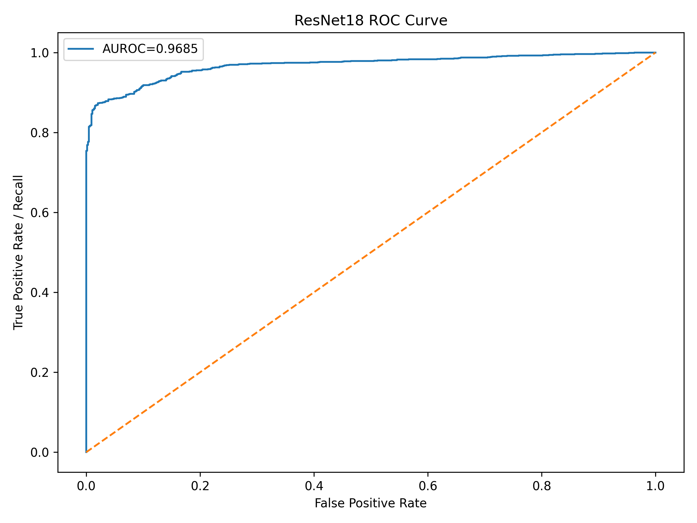
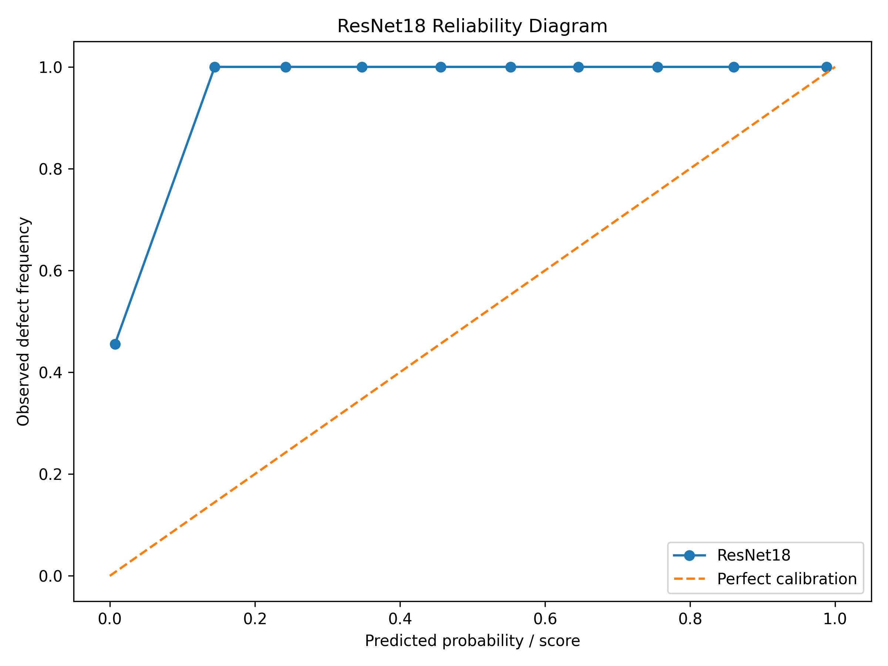
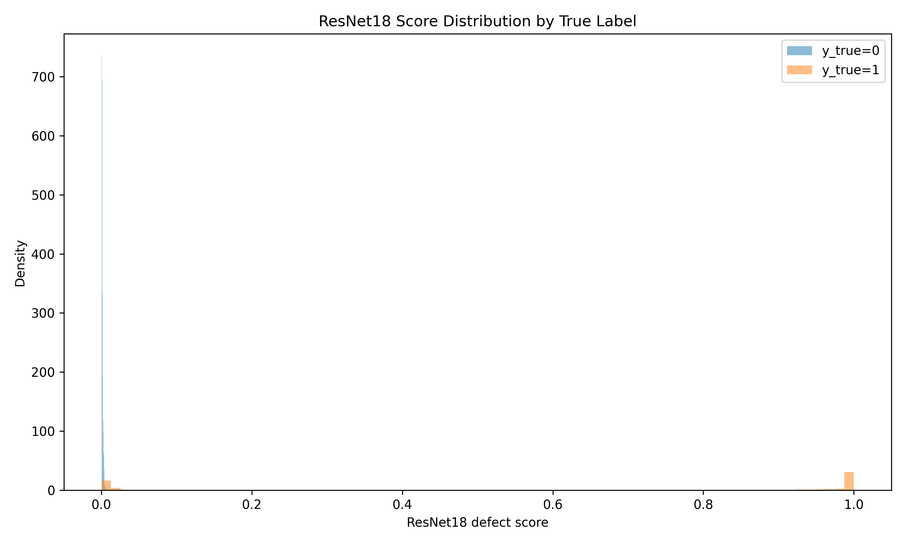
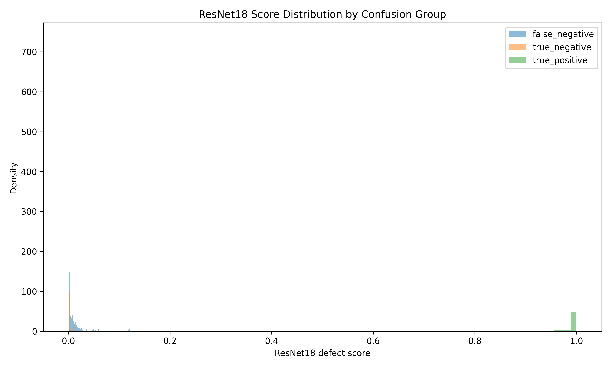

# ResNet18 Failure Analysis

## Executive Summary

The ResNet18 classifier did not fail because it lacked useful ranking signal. It failed because the Oct14-selected threshold did not transfer safely to Nov8, and because many real Nov8 defects received extremely low defect scores.

At the original threshold `0.13`, ResNet18 produced zero false positives but missed `561` defects. Lowering the threshold to `0.002` improved recall from `0.6979` to `0.9521`, reduced false negatives from `561` to `89`, and increased F1 from `0.8221` to `0.9457`. The cost was `114` false positives.

## Training and Evaluation Setup

ResNet18 was used as a supervised binary classifier with ImageNet-pretrained weights and a two-class output head. Training used the Oct14 source domain, and testing used the unseen Nov8 domain.

| Split | Domain | Normal | Defective | Total |
|---|---|---:|---:|---:|
| Train | Oct14 | 3,326 | 818 | 4,144 |
| Validation | Oct14 | 831 | 205 | 1,036 |
| Test | Nov8 | 641 | 1,857 | 2,498 |

Training used weighted sampling and class-weighted cross entropy to handle the Oct14 class imbalance. The important limitation is that validation was same-domain Oct14, while the later test set was shifted Nov8.

## Original Threshold vs Tuned Threshold

| Operating Point | Threshold | Precision | Recall | F1 | False Positives | False Negatives | Specificity |
|---|---:|---:|---:|---:|---:|---:|---:|
| Original frozen threshold | 0.130 | 1.0000 | 0.6979 | 0.8221 | 0 | 561 | 1.0000 |
| Best F1 / recall >= 0.95 | 0.002 | 0.9394 | 0.9521 | 0.9457 | 114 | 89 | 0.8222 |

The original threshold was too conservative for a defect-inspection system. It protected precision perfectly but allowed too many escaped defects. The tuned threshold is a much stronger baseline, although it still leaves `89` missed defects that should be understood before relying on the model alone.

## Curve Metrics

| Metric | Value |
|---|---:|
| AUROC | 0.9685 |
| AUPRC | 0.9902 |

The curves show strong ranking potential, but they do not choose the operating threshold. This is why the original high-AUROC model could still miss `561` defects.

## Calibration

| Calibration Metric | Value |
|---|---:|
| Brier score | 0.2550 |
| Expected Calibration Error | 0.2894 |

The Nov8 defect score should be treated as a ranking score, not a calibrated probability. Poor calibration helps explain why an Oct14 threshold did not transfer cleanly to Nov8.

## False-Negative Score Analysis

| Score Band | False Negatives | Share of False Negatives |
|---|---:|---:|
| [0.00, 0.01] | 345 | 61.50% |
| [0.01, 0.03] | 124 | 22.10% |
| [0.03, 0.06] | 41 | 7.31% |
| [0.06, 0.10] | 26 | 4.63% |
| [0.10, 0.13] | 25 | 4.46% |

Most missed defects were not borderline cases near the original threshold. `83.60%` of false negatives scored below `0.03`, meaning the model often assigned real defects a normal-like score.

## Error Characteristics

| Statistic | False Negative Mean | True Positive Mean | Difference |
|---|---:|---:|---:|
| Mean intensity | 121.03 | 123.76 | -2.73 |
| Intensity standard deviation | 59.36 | 64.63 | -5.27 |
| Contrast, p95-p5 | 159.50 | 165.45 | -5.94 |
| Sharpness, Laplacian variance | 121.16 | 171.76 | -50.60 |
| Edge density | 0.2475 | 0.2480 | -0.0005 |

False negatives were lower contrast and much lower sharpness than true positives. This connects the ResNet18 failure to the dataset shift described in [Model Selection Report](model_selection_report.md): the held-out batch was already darker, lower contrast, and less sharp, and the missed defects were among the less visually favorable cases.

## Production Interpretation

ResNet18 at threshold `0.002` is the best balanced single-model baseline from the supervised analysis. It is fast and accurate enough to be useful, but the remaining missed defects show why it should be paired with drift monitoring and a review or anomaly-safety mechanism rather than treated as an unquestioned hard PASS/FAIL classifier.

The next comparison is whether anomaly models can catch additional defects without overwhelming the review process. See [Anomaly Model Analysis](anomaly_model_analysis.md).
